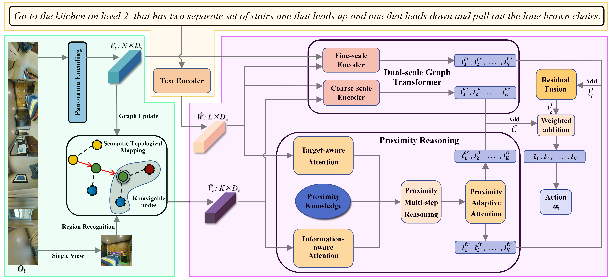

# Hierarchical Spatial Proximity Reasoning for Vision-and-Language Navigation

Most Vision-and-Language Navigation (VLN) algorithms tend to make deci-sion errors, primarily due to a lack of visual common sense 
and insufficient reasoning capabilities. To address this issue, this paper proposes a Hierar-chical Spatial Proximity Reasoning (HSPR) model. 
Firstly, we design a Sce-ne Understanding Auxiliary Task (SUAT) to assist the agent in constructing a knowledge base of hierarchical spatial proximity 
for reasoning navigation. Specifically, this task utilizes panoramic views and object features to identify regions in the navigation environment 
and uncover the adjacency relation-ships between regions, objects, and region-object pairs. Secondly, we dynam-ically construct a semantic topological map 
through agent-environment in-teractions and propose a Multi-step Reasoning Navigation Algorithm (MRNA) based on the map. This algorithm continuously 
plans various feasi-ble paths from one region to another, utilizing the constructed proximity knowledge base, enabling more efficient exploration. 
Additionally, we intro-duce a Proximity Adaptive Attention Module (PAAM) and Residual Fusion Method (RFM) to enable the model to obtain more accurate 
navigation deci-sion confidence. Finally, we conduct experiments on publicly available da-tasets including REVERIE, SOON, R2R, and R4R to validate the 
effective-ness of the proposed approach.



## Requirements

1. Install Matterport3D simulators: follow instructions [here](https://github.com/peteanderson80/Matterport3DSimulator).
   We use the latest version instead of v0.1.

```
export PYTHONPATH=Matterport3DSimulator/build:$PYTHONPATH
```

2. Install python>=3.8, pytorch==1.7.1:

```setup
conda create --name hspr python=3.8.5
conda activate hspr
# conda
conda install pytorch==1.7.1 torchvision==0.8.2 torchaudio==0.7.2 cudatoolkit=11.0 -c pytorch
# pip
pip install torch==1.7.1+cu110 torchvision==0.8.2+cu110 torchaudio==0.7.2 -f https://download.pytorch.org/whl/torch_stable.html
```

3. Install requirements:

```setup
pip install -r requirements.txt
```

4. Download data from [Dropbox](https://www.dropbox.com/sh/u3lhng7t2gq36td/AABAIdFnJxhhCg2ItpAhMtUBa?dl=0), including
   processed annotations, features and pretrained models of REVERIE, SOON, R2R and R4R datasets, download labels about
   the navigation environment from [Baidu Netdisk](https://pan.baidu.com/s/1MbS43QQkqtDBPWZ-hr5Uqg?pwd=23r7), and put it
   all into the 'datasets' directory.

5. Download pretrained lxmert

```
mkdir -p datasets/pretrained 
wget https://nlp.cs.unc.edu/data/model_LXRT.pth -P datasets/pretrained
```

## Pretraining

Combine behavior cloning and auxiliary proxy tasks in pretraining:

```pretrain
cd pretrain_auxiliary_src
bash run_reverie.sh # (run_soon.sh, run_r2r.sh, run_r4r.sh)
```

## Fine-tuning & Evaluation

Use pseudo interative demonstrator to fine-tune the model:

```finetune
cd reasoning_nav_src
bash scripts/run_reverie.sh # (run_soon.sh, run_r2r.sh)
```
